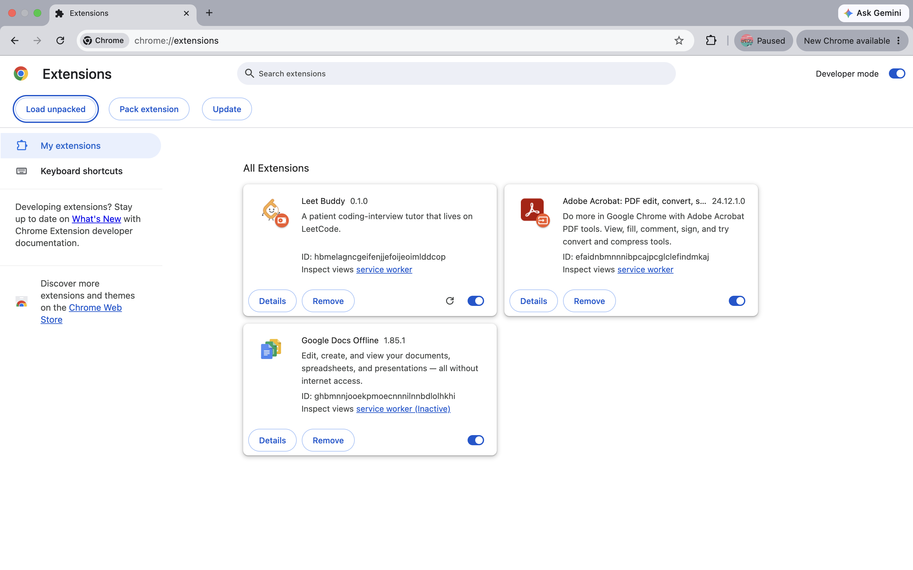
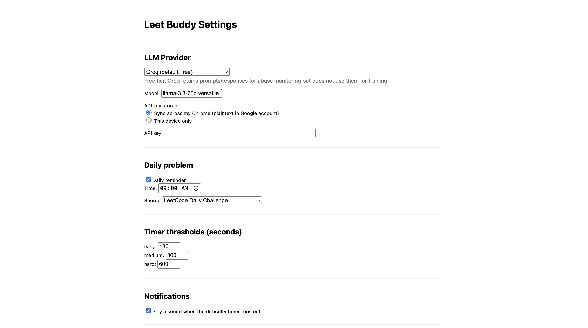
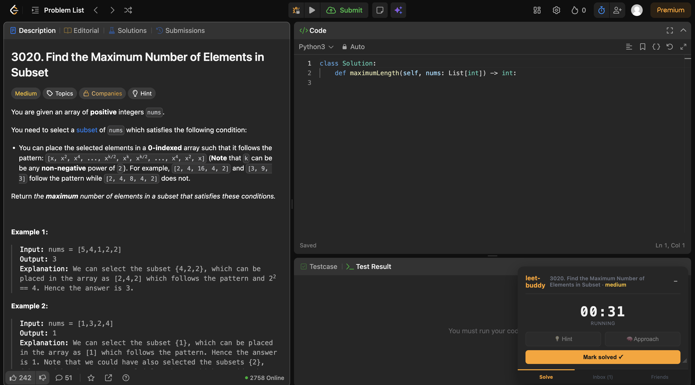
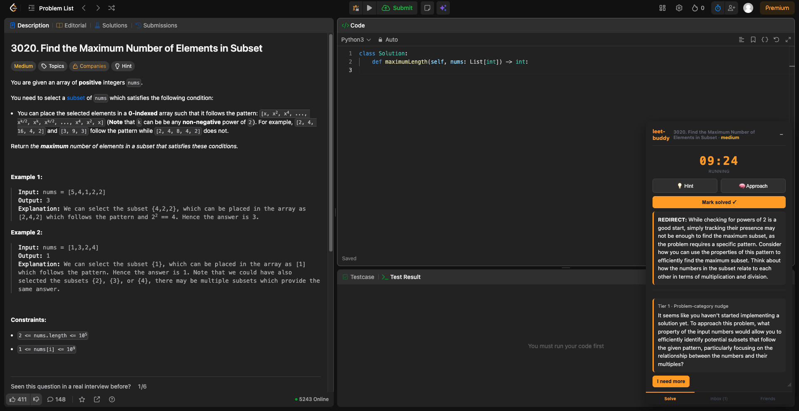
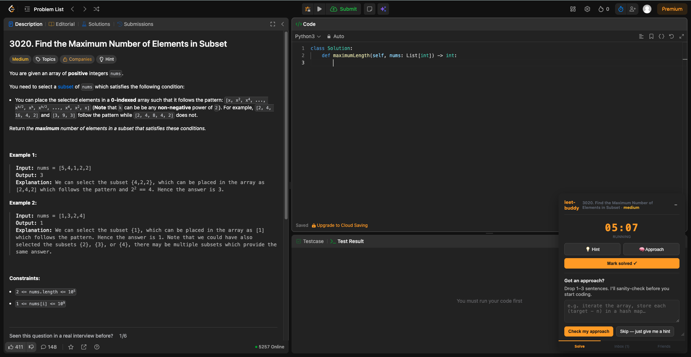
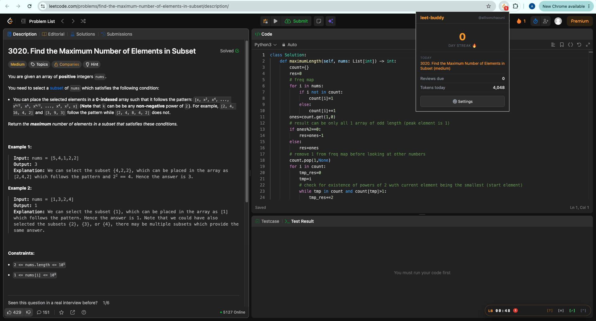

# Leet Buddy

<p align="center">
  
</p>

<p align="center"><strong>Your buddy that keeps you from giving up too early or spending forever on LeetCode problems.</strong></p>

---

## Install

1. **Clone the repo**
   ```bash
   git clone https://github.com/your-username/leet-buddy.git
   cd leet-buddy
   ```

2. **Install dependencies**
   ```bash
   npm install
   ```

3. **Build the extension**
   ```bash
   npm run build
   ```

4. **Load in Chrome**
   Open `chrome://extensions`, enable **Developer mode** (top right), click **Load unpacked**, and select the `dist/` folder.

<!-- screenshot: chrome://extensions page with leet-buddy loaded -->



5. **Pin the extension** (optional but recommended)
   Click the puzzle piece icon in the toolbar, find Leet Buddy, and click the pin icon to keep it visible.

6. **Login to extension**
   Click the extension icon, then enter your email. You will receieve a 6 digit code in your inbox. This enables friend challenges and syncs your stats.

7. **Configure settings**
   Click the gear icon in the popup or right-click the extension icon and choose **Options** to set your AI provider, API key, daily problem source, and hint threshold.




---

## What it does

You're 40 minutes into a LeetCode problem. You've been staring at a blank editor, you're about to open the solution tab, and you know you won't remember any of it tomorrow. Leet Buddy sits on every `leetcode.com/problems/*` page as a small panel. It watches your time, holds back hints until you've genuinely tried, asks you to say your approach before you start typing, and schedules reviews so problems you've solved before come back at the right time.

---

## Features

### Stuck timer + progressive hints

A timer starts when you open a problem. After a per-difficulty threshold (configurable for easy / medium / hard), hints unlock one at a time — just enough to get unstuck without spoiling the solution. Click the timer to pause and resume.

<!-- screenshot: panel on a problem page with stopwatch running -->


<!-- screenshot: hints expanded showing progressive reveal -->


---

### Approach-first prompt

When the hint threshold fires and you haven't written much code yet, Leet Buddy asks you to describe your approach first. You can also open it manually at any time after hints unlock. Forces you to think before you implement.

<!-- screenshot: approach-first prompt dialog -->


---

### Spaced-repetition reviews

Problems you mark as solved get scheduled for review using SM2. The extension nudges you to revisit them before you forget.

<!-- screenshot: spaced-repetition review card in popup -->

---

### Daily problem nudge

Pick a problem list — LC Daily, Blind 75, NeetCode 150, LC 75, or company-tagged — and get a daily reminder to attempt one problem from it.

<!-- screenshot: daily nudge notification or popup daily tab -->

---

### Challenger

Sign in to race a friend on the same problem. After solving a problem, send a challenge with your solve time attached. Your friend sees it in their Inbox tab, accepts, and races on the same problem. First to submit a passing solution wins — result screen shows winner and your current streak.

The panel's bottom navigation has three tabs: **Solve** (timer + hints), **Inbox** (incoming challenges), and **Friends** (manage your friend list).

---

## Configuration

Right-click the extension icon → **Options**, or click the gear icon inside the popup.

| Setting | Details |
|---|---|
| **AI provider** | Groq (free, default), Google AI Studio / Gemini (free), Anthropic (paid), OpenAI (paid) |
| **API key** | Get a free Groq key at [console.groq.com](https://console.groq.com) |
| **Daily source** | LC Daily / Blind 75 / NeetCode 150 / LC 75 / Company-tagged (Premium) |
| **Hint threshold** | Separate unlock times for easy / medium / hard (in seconds) |
| **Timer sound** | Play a ping when hints unlock |
| **Hourly request cap** | Max AI calls per hour |
| **Backup** | Export / import all progress as JSON |

<!-- screenshot: options page -->

---

## Development

```bash
npm test                # vitest
npm run typecheck       # tsc --noEmit (strict)
npm run build           # vite build → dist/
npm run dev             # vite dev server (popup/options pages)
```
